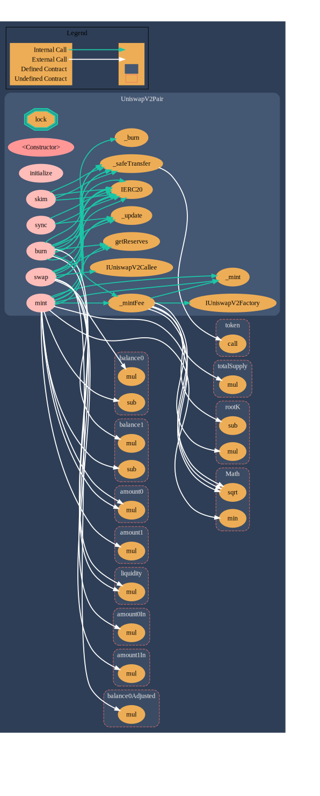

# Uniswap V2's UniswapV2Pair.sol

## Protocol Overview
Uniswap is an automated liquidity protocol powered by a [constant product formula](https://docs.uniswap.org/protocol/V2/concepts/protocol-overview/glossary#constant-product-formula) and implemented in a system of non-upgradeable smart contracts on the Ethereum blockchain.

Each Uniswap smart contract, or pair, manages a liquidity pool made up of reserves of two ERC-20 tokens.

More information [here](https://docs.uniswap.org/protocol/V2/concepts/protocol-overview)

## Contract Overview
**PATH: [./contracts/UniswapV2Pair.sol](./contracts/UniswapV2Pair.sol)** 

**SOLIDITY VERSION: =0.5.16 (released Jan 02, 2020)**

**GRAPH:**

### Imports

|Path|Summary|Graph|
|---|---|---|
|[./interfaces/IUniswapV2Pair.sol](./contracts/interfaces/IUniswapV2Pair.sol)| An interface containing all function selectors of the UniswapV2Pair contract. | [here](./imgs/IUniswapV2Pair.svg)
|[./UniswapV2ERC20.sol](./contracts/UniswapV2ERC20.sol)| ERC20 Contract for UniswapV2. Constructs `DOMAIN_SEPARATOR` using [EIP712Domain](https://github.com/ethereum/EIPs/blob/master/EIPS/eip-712.md) mechanism. | [here](./imgs/UniswapV2ERC20.svg)|
|[./libraries/Math.sol](./contracts/libraries/Math.sol)| A library used for performing selected mathematical operations `(min & sqrt)` on `uint`.| [here](./imgs/UniswapV2ERC20.svg) |
|[./libraries/UQ112x112.sol](./contracts/libraries/UQ112x112.sol)| A library for handling fixed point numbers (binary) in range of `[0, (2**112 -1)]` and resolution of `1/2**112`. Operations supported are `encode` and `uqdiv`| [here](./imgs/UQ112x112.svg) |
|[./interfaces/IERC20.sol](./contracts/interfaces/IERC20.sol)| The ERC20 interface with optional `name`, `symbol`, `decimals` functions. |[here](./imgs/IERC20.svg)|
|[./interfaces/IUniswapV2Factory.sol](./contracts/interfaces/IUniswapV2Factory.sol)| An interface of the UniswapV2Factory [factory contract](https://soliditydeveloper.com/clonefactory/). |[here](./imgs/IUniswapV2Factory.svg)|
|[./interfaces/IUniswapV2Callee.sol](./contracts/interfaces/IUniswapV2Callee.sol)|A single function interface (the uniswapV2call function) | [here](./imgs/IUniswapV2Callee.svg)|

### REMARKS
1. IUniswapV2Pair is a superset of IERC20.

## References
1. https://github.com/ethereum/solidity/tree/v0.5.16
2. https://github.com/ethereum/solidity/releases?after=v0.6.12&page=4#:~:text=Compare-,Version%200.5.16,-This%20release%20fixes
3. 
